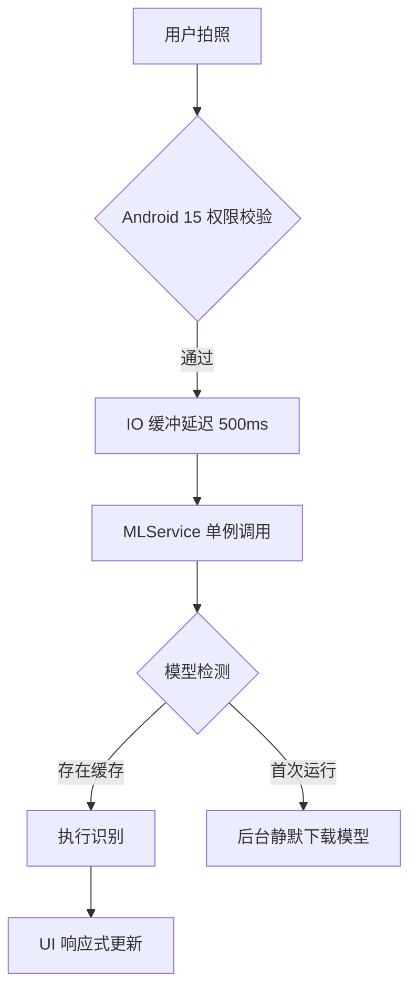

🚀 核心技术(Technical Deep Dive)
1. Android 15 分区存储与文件 IO 策略
    问题描述：
    在 Android 15 系统下，相机拍照后的临时文件写入与 Flutter 的读取存在微秒级的时差，直接调用会导致 FileNotfound 或识别引擎卡死。

    对策：引入 时序缓冲机制。在调用 ML Kit 之前，通过 
            Future.delayed(const Duration(milliseconds: 500)) 
            确保系统 MediaStore 索引与物理文件写入同步，并配合 READ_MEDIA_IMAGES 权限确保合规访问。

2. 原生层依赖注入 (Gradle Dependency Injection)
   问题描述：
   Flutter 的 google_ml_kit 插件在 Android 原生层默认仅包含拉丁语 (Latin) 脚本，导致中文识别时抛出 ClassNotFoundException 导致闪退。

   对策：手动修改 `android/app/build.gradle`，显式声明原生中文 OCR 依赖：
   ```gradle
   dependencies {
       implementation 'com.google.mlkit:text-recognition-chinese:16.0.0'
   }

3. 基于单例模式的内存与崩溃管理
    问题描述：在重构初期，由于频繁实例化 TextRecognizer，在 Oppo 手机的高内存管理策略下极易触发 Signal 3 (SIGQUIT)。

    对策：
     - 单例管理：将 TextRecognizer 静态化，避免堆内存碎片化。
     - 预热模式 (Warmup)：在 initState 中通过空文件预调用的方式，提前激活 Google Play 服务的模型下载线程，将 15MB 的中文语言包下载压力前置。

📊 识别算法流图 (Sequence Diagram)
Code snippet
